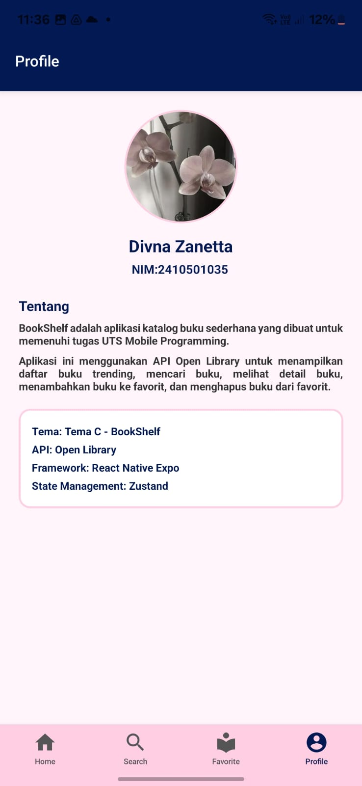
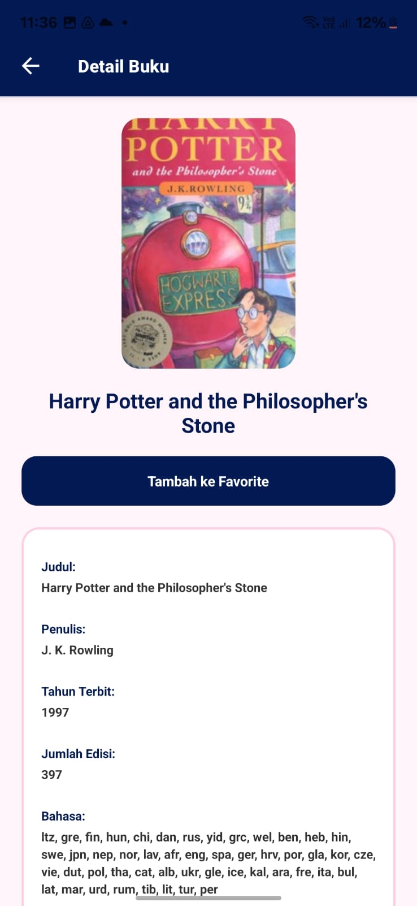
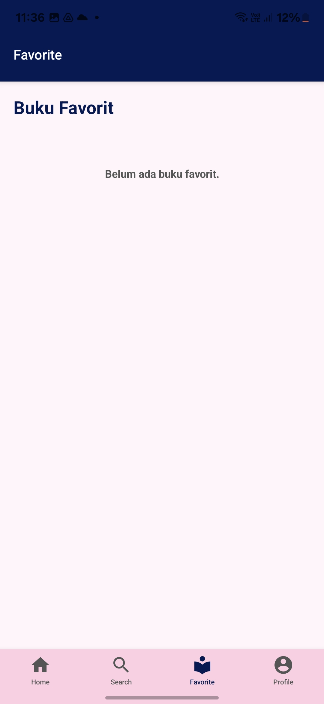
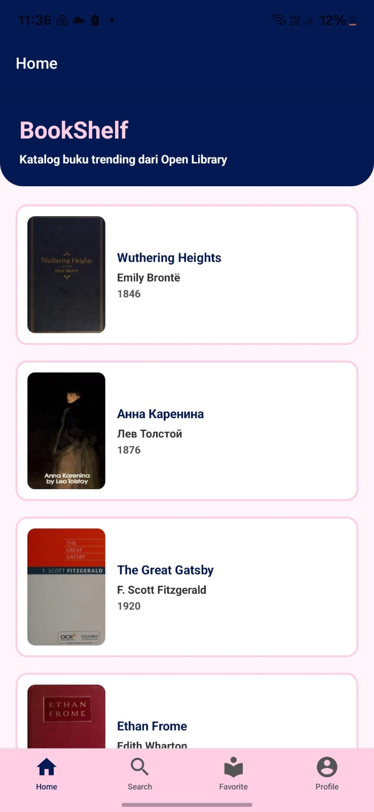
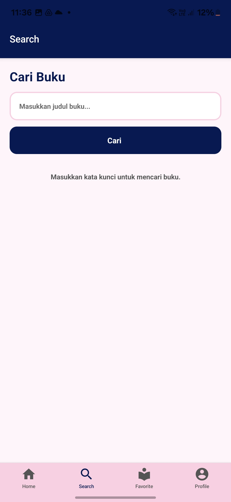

# BookShelf-UTS
**Nama:** Divna Zanetta Putri  
**NIM:** 2410501035  
**Kelas:** B 
**Tema:** Tema C - BookShelf

## Tech Stack
- React Native (Expo 49.0.0)
- Zustand (state management)  
- Open Library API

## Cara Install & Run
```bash
# clone repository
git clone https://github.com/divnazanetta/uts-mobile-lanjut-2410501035-divnazanettaputri.git
# masuk ke folder project
cd BookShelf-UTS
# install dependencies
npm install
# jalankan aplikasi
npm start
```

## Screenshots
### About Screen

### Detail Screen

### Favorite Screen

### Home Screen

### Search Screen


## Link Video Demo
[Klik untuk menonton demo aplikasi]((https://youtu.be/mltd7u_2tro?si=ICpJUdu3I0u3lG2t))

## Justifikasi State Management

Saya menggunakan **Zustand** untuk state management karena beberapa alasan:  
- **Ringan dan mudah digunakan**, cocok untuk aplikasi kecil hingga menengah.  
- **Memudahkan sinkronisasi data antar screen**, contohnya daftar buku favorit bisa langsung terupdate tanpa reload seluruh aplikasi.  
- **Struktur kode tetap rapi dan efisien**, sehingga mudah dipelihara dan scalable untuk fitur tambahan di masa depan.  

Zustand membantu menjaga data global tetap konsisten dan meminimalkan boilerplate dibandingkan state management lain seperti Redux, sehingga workflow development lebih cepat.

## Daftar Referensi

1. Open Library API Documentation: https://openlibrary.org/developers/api  
2. React Native Expo Documentation: https://docs.expo.dev/  
3. Zustand Documentation: https://docs.pmnd.rs/zustand  
4. Tutorial React Native & Open Library API (YouTube / Blog)

## Refleksi

Mengerjakan proyek BookShelf-UTS memberikan pengalaman belajar menyeluruh dalam pengembangan aplikasi mobile. Saya belajar bagaimana mengatur struktur proyek, menghubungkan aplikasi dengan API eksternal (Open Library), dan menampilkan data secara dinamis di berbagai screen.  

Selain itu, saya memahami pentingnya state management untuk menjaga konsistensi data antar screen, sehingga memilih menggunakan Zustand yang sederhana namun efektif. Implementasi fitur favorit, pull-to-refresh, dan error handling mengajarkan saya bagaimana membuat aplikasi yang responsif dan user-friendly.  

Proses commit deskriptif, push ke GitHub, serta penulisan README lengkap juga melatih keterampilan dokumentasi dan version control. Secara keseluruhan, proyek ini meningkatkan pemahaman teknis saya tentang React Native, API integration, manajemen state, serta alur end-to-end pengembangan aplikasi mobile. Pengalaman ini juga menambah kepercayaan diri saya untuk mengerjakan proyek mobile yang lebih kompleks di masa depan.
